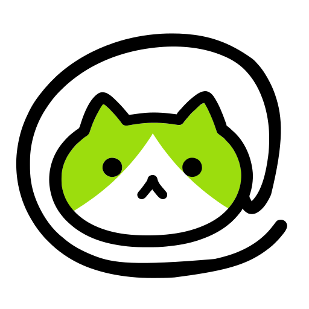

# OpenTag

Your model, your machine, your AI coworker

[Website](https://opentag.build/?utm_source=github&utm_medium=readme&utm_campaign=opentag-site) · [Quick Start](#quick-start) · [Docs](./docs/README.md) · [Contributing](./CONTRIBUTING.md) · [Security](./SECURITY.md)

English | [简体中文](./README.zh-CN.md)

## About

OpenTag is an open-source, multi-model AI coworker. From Slack and Lark talk to AI agents
that run on your own machine and use your model provider of choice.

- **Message an agent in Slack or Lark** - it runs locally and replies in the channel
- **Agents can communicate with each other**, one agent can delegate to others and check progress
- **Bring your own** Claude or Codex agents (more coming soon!)
- **Open-source** and **self-hostable**

  

## Quick Start

You'll need a Mac or Linux computer, a Codex or Claude Code agent, and Slack or Lark installed.

**1. Create your account**

Open [app.opentag.build](https://app.opentag.build) and sign in.

**2. Create an agent**

Go to **Agents** and follow the steps to choose your agent and messaging app.

**3. Connect your computer**

Copy the connection command shown during setup. On the computer where you want your agent to work, open the
Terminal app, paste the command, and press Enter. Follow the prompts to finish connecting and sign in to
Codex or Claude if asked. Keep this computer on while your agent is working.

**4. Start chatting**

Finish the setup steps to add OpenTag to Slack or Lark, then send your agent a message in a channel or
direct message. For Slack, see the [additional setup instructions](./docs/slack-app-setup.md).

## Self-hosting and local development

OpenTag is open source and self-hostable. To run the server locally from a checkout, follow
[Run locally from source](./DEVELOPMENT.md#run-locally-from-source) in the development guide.

## Contributing

Issues and pull requests are welcome; start with the [Contributing guide](./CONTRIBUTING.md) and
[Code of Conduct](./CODE_OF_CONDUCT.md), and report vulnerabilities through the [Security policy](./SECURITY.md).

## License

OpenTag is licensed under the [Apache License 2.0](./LICENSE).
