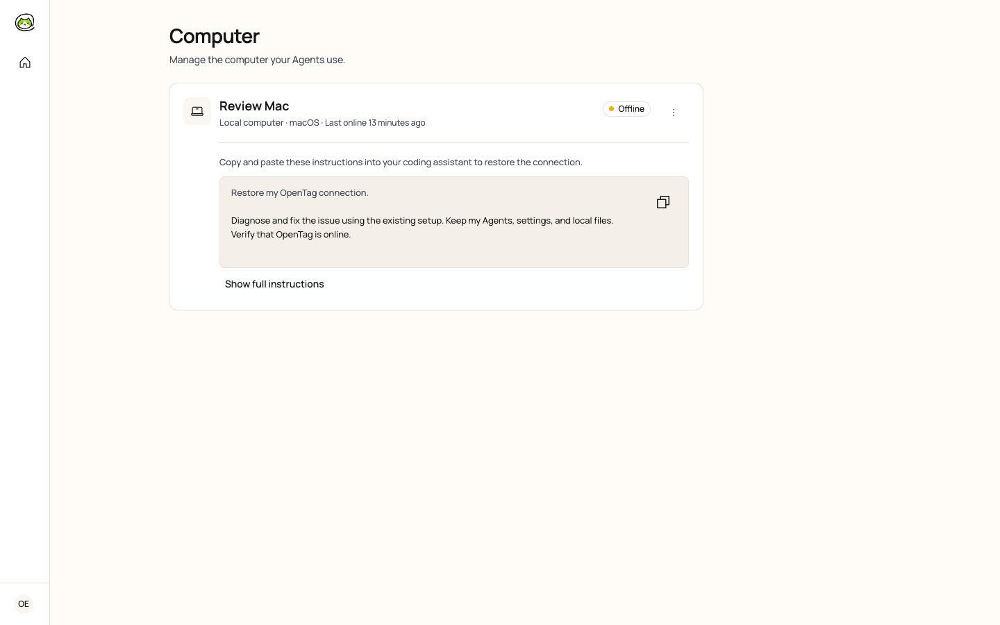
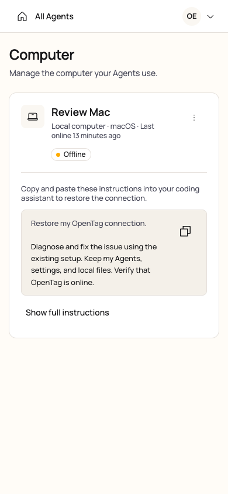

# Computer management and recovery UI

[简体中文](./README.zh-CN.md)

Reviewed on 2026-10-10. These screenshots capture the built application against an isolated Server and PostgreSQL database. “Review Mac” is a demonstration Computer; the screenshots contain no connection codes or credentials.

Every Computer is visible on the main page. Online cards remain compact. Offline local Computers show recovery instructions automatically, with a readable summary, a copy control for the complete task, and **Show full instructions** expanding inside the same card. The connection status updates from the Server; copying instructions alone does not report a successful repair. The only management menu action is **Remove computer…**, with the existing confirmation and Agent-binding guards.

## Interaction verification

- Compact and expanded layouts were checked at 320, 390, 768, and 1440 px without page-level horizontal overflow or axe violations. Desktop Cloud and local Online cards had equal heights; recovery content increases card height naturally.
- Full instructions expand inline without navigation or a modal. Copying includes the complete diagnostic task. Clipboard denial expands and selects that task for manual copying.
- Real CLI/daemon round trips verified expiry, renewal, redemption, and automatic restoration while preserving the Computer identity and Agent bindings. Failure of the optional authorization-status request still permits restoration through the existing credential.
- Expired instructions lose their copy controls. When a focused recovery control disappears after expiry, redemption, or restoration, focus returns to its Computer card without scrolling. Removal cancellation restores focus to its trigger.
- English and Chinese mobile layouts and the guarded removal flow were checked in Chromium. Nine formal Playwright E2E tests passed, including the Agent Setup Lab journey and browser/responsive smoke tests.

The coding assistant's external AI provider was not invoked during these checks.
