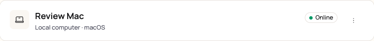
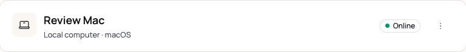
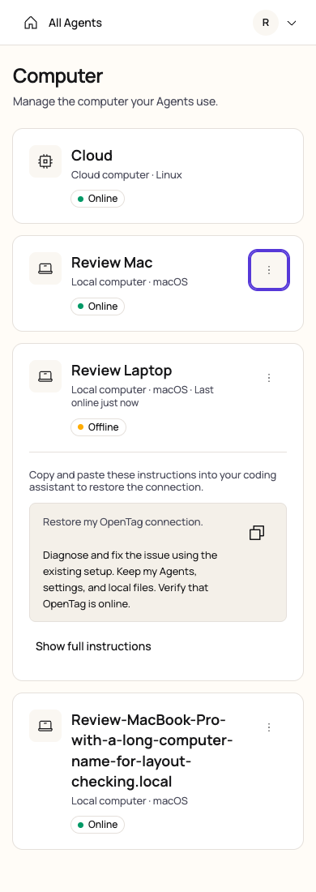

# Computer status and menu alignment

[简体中文](./README.zh-CN.md)

Verified on 2026-10-10 against the production Web build with representative API fixtures. Screenshots use demonstration Computers.

The compact header previously placed the menu icon 5.5 CSS pixels below the connection status center. Status padding and inline baseline spacing contributed to the mismatch. The status and action wrappers now use flex layout, and both desktop grid cells center themselves within the first row. Mobile keeps the status below the Computer identity.

Before:

After:

At 1440 and 768 px, the measured status/menu center difference is 0 px for Online, Offline, and wrapping Computer names. At 320, 390, 768, and 1440 px, compact and expanded recovery instructions have no page-level horizontal overflow. Menu targets remain 44 × 44 px; Escape closes the menu and restores focus to its trigger. Cloud cards remain compact.

The Web production build, `pnpm check`, and 18 unique affected management/localization/removal tests passed. One removal test initially exceeded its default five-second budget; all five removal tests passed on retry with a thirty-second budget. Repository test budgets and test code were not changed. This layout review does not repeat live connection-repair verification.
