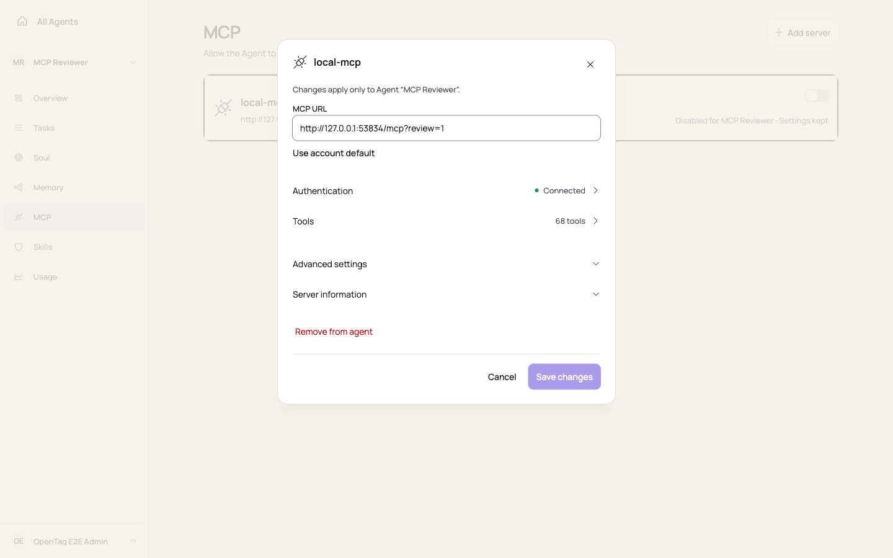
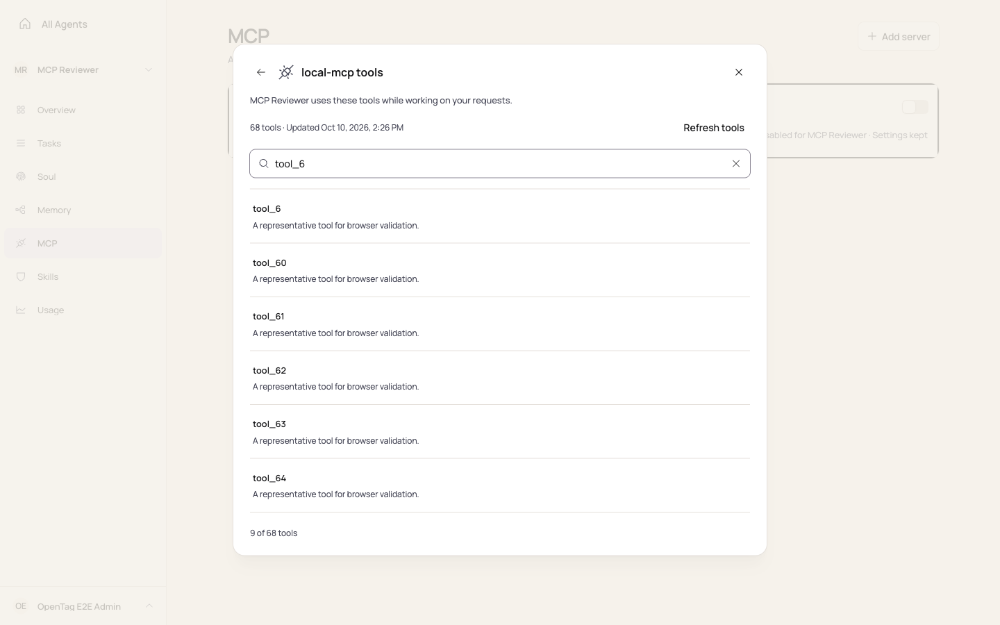
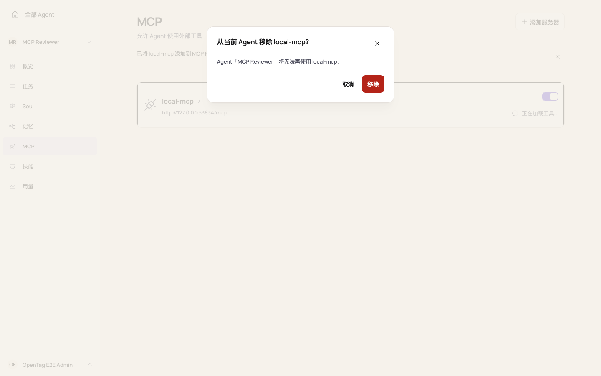

# MCP management UI validation

The MCP list opens server details from the service identity and keeps the Agent enable switch independent.
Details group Authentication, Tools, Advanced settings and Server information in that order. Authentication and
Tools replace the current dialog and return to their source; destructive confirmations replace it as well.

## Browser validation

The implementation was exercised in a real Chromium browser against built Web assets, OpenTag APIs, an isolated
PostgreSQL database and a local MCP/OAuth provider fixture. The fixture exposed 68 tools. No production provider
credentials or accounts were used. Screenshots below use disposable fixture data.

| Journey | Verified behavior |
| --- | --- |
| Unsaved settings to Tools to Reconnect | Keep editing preserves the draft. Save and continue persists settings before opening authentication. |
| OAuth | Real discovery, consent redirect, token exchange and callback restore the originating Tools view. A denied consent callback shows an inline error; cancellation and retry preserve the search query. Consumed errors do not reappear on subsequent entry. |
| API key and no authentication | Method selection, masked/revealed input, credential save, failure retry and return navigation work. |
| Clear credentials | Cancellation keeps the typed draft. Confirmation clears the credential and tool snapshot, returns to authentication and empties the key field. |
| Tools | Search empty state, query preservation through Details, refresh progress, cached results on failure and successful retry work. Refreshing a disabled server does not enable it. |
| Remove from agent | Cancellation retains settings, disclosures and focus. Pending confirmation ignores Escape. Failure stays inline and can be retried. Successful removal closes the dialogs, removes the row and focuses Add server for the empty list. |
| Account scope | Removing the Agent binding leaves the account server available. It can be reattached through the existing-server picker without a duplicate row. |

Refresh, credential-save and removal failures were injected as HTTP 503 responses at the browser network boundary;
successful retries used the real API. OAuth denial was injected at the consent redirect and processed by the real
callback endpoint. Public provider compatibility was not tested.

## Responsive and accessibility evidence

| Language and dialog | 320px | 390px | 768px | 1440px |
| --- | --- | --- | --- | --- |
| English expanded Details | Pass | Pass | Pass | Pass |
| English Tools | Pass | Pass | Pass | Pass |
| English API key authentication | Pass | Pass | Pass | Pass |
| English remove confirmation | Pass | Pass | Pass | Pass |
| Chinese collapsed and expanded Details | Pass | Pass | Pass | Pass |
| Chinese Tools and authentication | Pass | Pass | Pass | Pass |
| Chinese remove confirmation and list | Pass | Pass | Pass | Pass |

Pass means no horizontal document/dialog overflow and no dialog extending beyond the viewport. Automated axe
WCAG 2 A/AA and WCAG 2.1 AA scans of the tested dialogs reported zero violations. Twenty-five sequential Tab stops
remained within Details or its standard focus guards. Browser checks also verified focus restoration after cancel
and removal. These checks do not replace a manual accessibility audit.

The UI reuses the existing Dialog, Button, Field, Input and Collapsible primitives. MCP-specific CSS controls list
alignment, dialog scroll bounds, grouped rows and mobile layout; it introduces no theme values or global overrides.

## Screenshots

Desktop captures accompany the responsive assertions above; no mobile screenshot is claimed.

