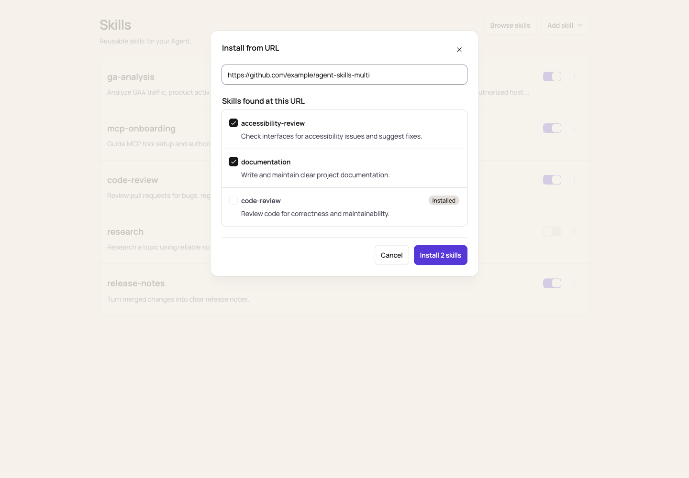
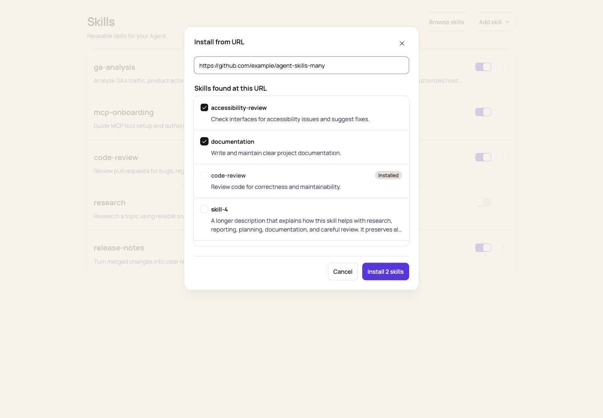
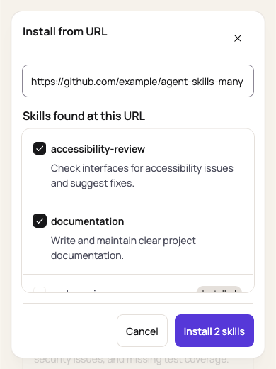
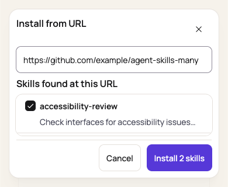

# Skills management UI validation

These browser screenshots show the actual Skills components with synthetic API fixtures: five
installed Skills with varied description lengths, one disabled Skill, and single, multiple, and
20-candidate URL sources. Remote sources include an already installed Skill and long descriptions.
The isolated preview harness and its build output are not shipped. The full Skill reader is a
separate change.

The subsequent [full-application PR review](./review/README.md) records real API upload/download,
preset installation, deletion, storage gates, browser accessibility checks, and the follow-up fixes.

- Desktop: 1440 × 1000; 108px rows, single-line descriptions, 24px between text and controls.
- Mobile: 390 × 844; descriptions use the full row width and at most two lines.
- Additional widths checked: 320px and 768px, with no horizontal overflow.
- Interactions checked: Add skill menu, native upload picker and invalid format feedback, switches,
  more menu, deletion confirmation, Browse skills cards, single and multiple URL candidates, empty
  results, and lookup errors with retry. Upload conflict and Agent-switch protections are covered by
  the component tests.
- Keyboard checks: menu activation, URL autofocus, Enter lookup, Tab focus containment, Escape close,
  and focus restoration to Add skill. Switches and more menus have Skill-specific accessible names.
- URL dialogs grow naturally for one or three short results. With 20 results, only the list scrolls;
  the source, result heading, and confirmation remain visible. The list is capped at
  `min(360px, 45dvh)` and also shrinks to fit the dialog's remaining height. Install reports use the
  same bounded scrolling so Done remains reachable. An installation error appears inside the
  results region, which returns to the top to reveal it while retaining the selection.
- Additional dialog sizes checked: 768 × 600, 390 × 520, 320 × 568, 844 × 390, and 390 × 320.
  In a very short viewport (at most 416px high), spacing contracts and summaries use one line to
  keep a complete selectable row visible. Standard summaries use at most two lines; the original
  text remains in the DOM, in the hover title, and in each checkbox's accessible description.
- Keyboard scrolling to the end preserves the footer and selected count. Already installed items
  remain disabled. The URL input keeps an accessible name while its redundant visible label is
  removed; its placeholder is an action prompt.
- English and Chinese layouts were checked. Existing descriptions are truncated visually without
  rewriting the stored Skill content; hover reveals the complete description.

