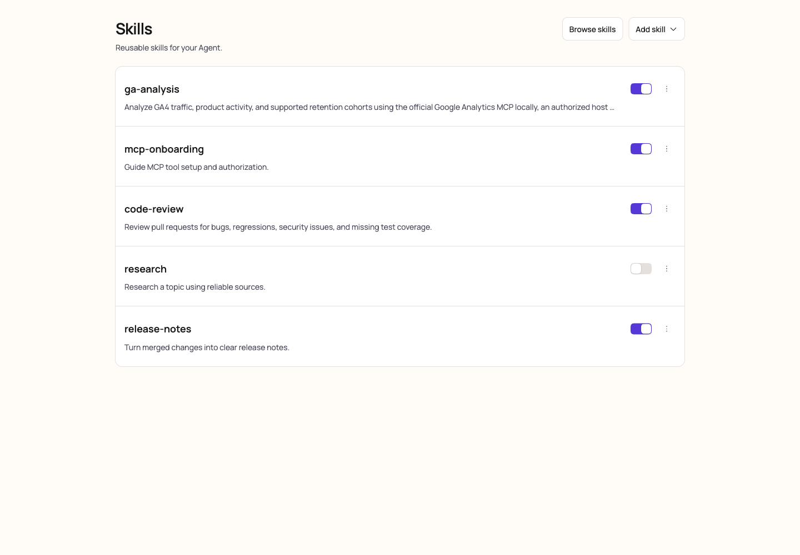
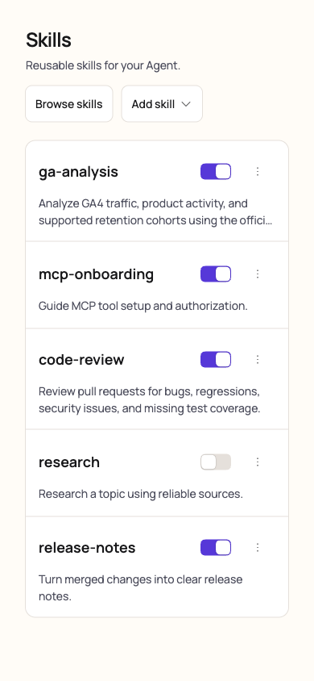
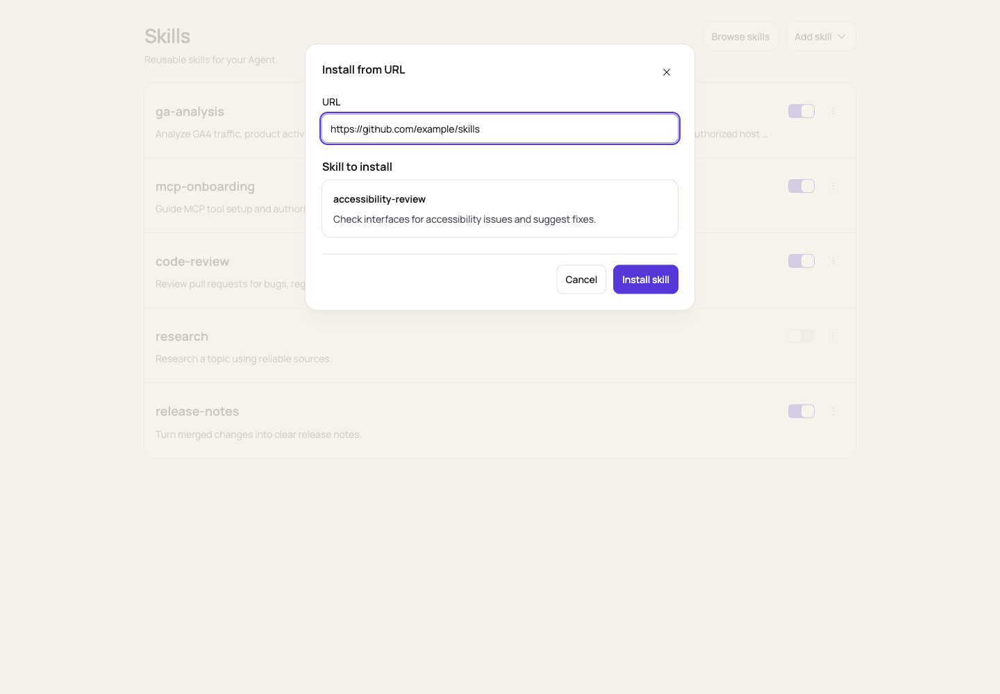

# Skills management UI validation

These browser screenshots show the actual Skills components with synthetic API fixtures: five
installed Skills with varied description lengths, one disabled Skill, and a single remote candidate.
The isolated preview harness and its build output are not shipped. The full Skill reader is a
separate change.

- Desktop: 1440 × 1000; 108px rows, single-line descriptions, 24px between text and controls.
- Mobile: 390 × 844; descriptions use the full row width and at most two lines.
- Additional widths checked: 320px and 768px, with no horizontal overflow.
- Interactions checked: Add skill menu, native upload picker and invalid format feedback, switches,
  more menu, deletion confirmation, Browse skills cards, single and multiple URL candidates, empty
  results, and lookup errors with retry. Upload conflict and Agent-switch protections are covered by
  the component tests.
- Keyboard checks: menu activation, URL autofocus, Enter lookup, Tab focus containment, Escape close,
  and focus restoration to Add skill. Switches and more menus have Skill-specific accessible names.
- English and Chinese layouts were checked. Existing descriptions are truncated visually without
  rewriting the stored Skill content; hover reveals the complete description.

