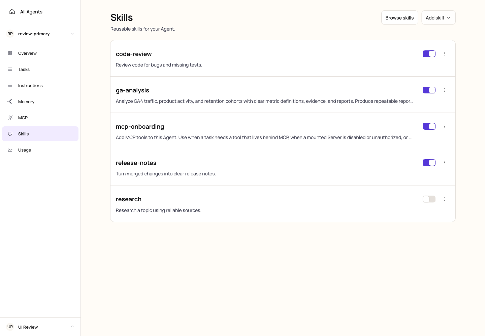
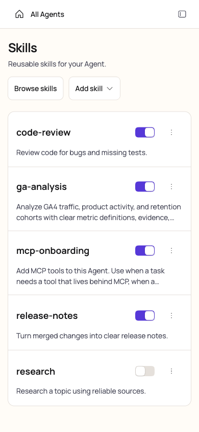
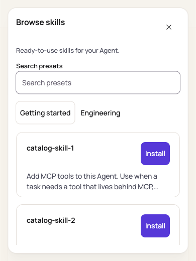
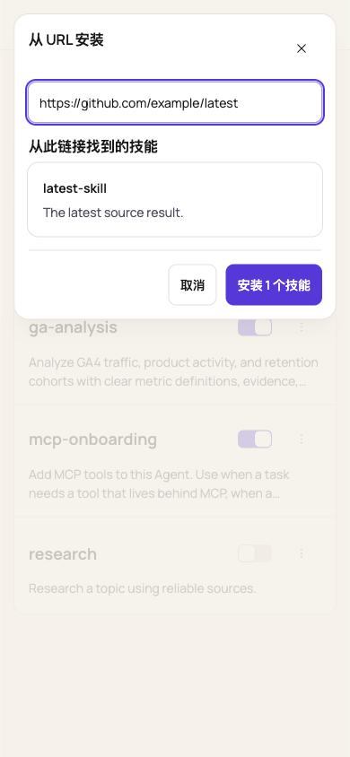
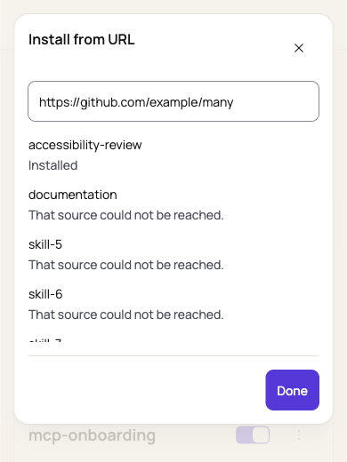
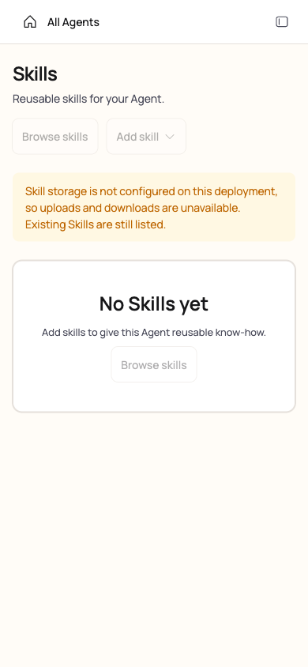

# PR #820 review and full-application browser validation

Reviewed the complete PR, including Skills management, both installation dialogs, asynchronous preview
state, translations, tests, and the Kumo stylesheet boundary. The complete Skill reader remains a
separate change.

## Findings fixed

1. Downloading an archive left the More menu open. `DropdownMenu.LinkItem` now closes on activation;
   its download URL and canonical filename remain intact. The component regression test verifies
   dismissal, and a browser download verifies the archive and subsequent interaction.
2. A large Browse skills catalog produced two scrolling surfaces in short windows. The dialog now
   allocates its remaining height to the card grid; its heading, description, search, and categories
   stay visible. Only the cards scroll.
3. The existing narrow-workspace journey test still expected the removed Upload skill button. It now
   checks the disabled Add skill entry when storage is unavailable.

## Test boundaries

The browser ran the built Web application through the real server, development login, routing,
PostgreSQL, and production Skills APIs. A disposable database isolated the review from existing
local services. Object storage used a local S3-protocol fixture exercising the production adapter's
PUT, GET, HEAD, and DELETE requests, including upload hash verification. This is not a cloud S3
provider compatibility test.

An external GitHub source was refused by this machine's outbound address policy. That error and
retry were verified against the real API. Successful URL discovery, delayed responses, installation
errors, and partial reports used HTTP response fixtures in the full application. The large preset
catalog used a response fixture; installation of the bundled mcp-onboarding preset used the real API.
No credentials or private production data are included in the evidence.

## Browser checks

- Native picker uploads: `.zip`, `.skill`, `.tar.gz`, and `.tgz`; persisted names and file counts were
  verified in PostgreSQL.
- An unsupported file was rejected locally with zero upload requests. An initial list failure kept
  Add skill disabled without claiming an empty list; Try again recovered the real list.
- Switch state persisted across reload. Download produced `ga-analysis.tar.gz`, with a valid
  SKILL.md and reference file. Re-uploading it required replacement confirmation and increased the
  stored revision from 1 to 2. Cancelling deletion retained the row; confirming deletion removed it.
- Installing the bundled preset refreshed the list and changed its card action to Installed.
- Single-result URL paste started discovery automatically and enabled installation without a
  checkbox. Multiple results required selection; installed and invalid entries stayed disabled.
- A delayed failure from an edited URL could not replace the newer result or display an obsolete
  error. Tab remained inside the dialog, and Escape/Done restored focus to Add skill.
- Installation failures retained the selection and returned the results to the top. An 18-item
  partial report scrolled independently while Done remained visible. During installation, URL
  editing and cancellation were disabled.
- The real deployment without storage rendered an empty secondary Agent and the storage notice,
  disabled Add skill and Browse skills, and stayed within the mobile viewport.
- English and Chinese URL forms were checked. Management descriptions were kept as stored and
  truncated visually. Agent navigation retained each Agent's own list.
- Axe WCAG 2 A/AA and 2.1 AA scans reported zero violations in the management content, Browse skills,
  URL candidate content, and the partial-report dialog.

The URL and large-catalog dialogs were measured at 1440×1000, 768×600, 390×844, 390×520,
320×568, 844×390, and 390×320. Neither dialog had horizontal overflow or an outer scrollbar.
At 390×520, Browse skills had an outer height/scrollHeight of 488/488px and a card viewport of
225px; the former outer overflow was eliminated. The URL report's Done footer ended at 461px in a
520px viewport.

## Automated checks

- Skills and Kumo contracts: 120 tests passed; translation catalog: 3 tests passed.
- Final Browse skills and Kumo rerun: 20 tests passed.
- `pnpm check`, Web production build, and `pnpm typecheck` passed.
- Full local Web suite: 1837 passed, 6 failed across four unchanged shell/onboarding files. All 71
  tests in those four files passed in isolated reruns. Several original failures were timeouts;
  the other failures were waiting for UI state. The full command was not green, and the isolated
  passes are recorded separately rather than reported as a clean full-suite run.
- All PR CI checks on the reviewed pre-fix commit `319569e5` passed, including unit tests across
  Node 22/24/26, PostgreSQL integration, browser smoke, runtime coverage, and patch coverage.
  The review follow-up commit must receive its own CI results.

## Screenshots

These images show the full application; the two URL examples and the expanded catalog use the
response fixtures described above.

