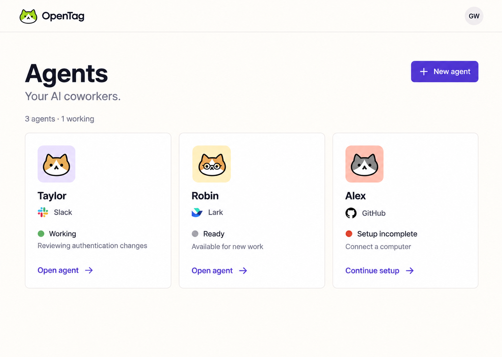
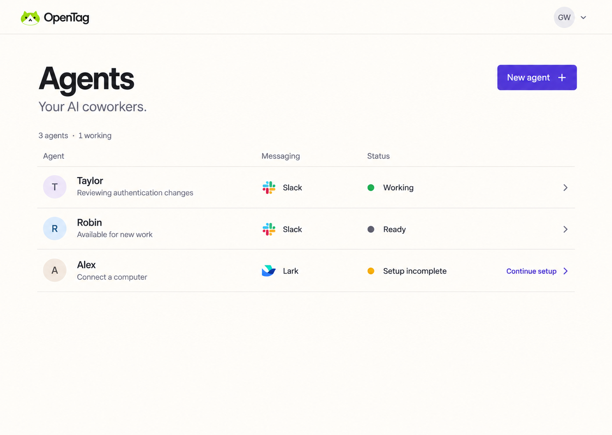

# OpenTag app design guide and reskin plan

Status: proposal for visual selection, 2026-09-28. The app has not been reskinned. The component recommendation is provisional until the pilot below has been reviewed.

This document translates the OpenTag website's visual language into a compact working app. It records the proposed system, the main screen compositions, the component-library decision, and the implementation sequence. Once a direction is selected, update this file in the same changes that implement it.

## Sources and authority

- Website: [opentag-site/design.md](https://github.com/first-tree-ai/opentag-site/blob/36596de/design.md), inspected alongside its local rendered homepage and `src/styles.css`. The website's guide currently describes separate violet website and green app accents; adopting violet in the app is a proposed change to that policy.
- App: baseline OpenTag commit `a978131d`; source inspected in the primary checkout with its pending cleanup changes, including [app.css](apps/web/src/app.css), [Kumo theme tokens](apps/web/src/ui/kumo-theme.tokens.ts), [semantic adapter](apps/web/src/ui/design-system.tsx), shell, page modules, and their tests. Authenticated app screens were assessed from source; they were not captured in a running app during this exploration.
- Existing implementation and acceptance rules: [Web UI contract](docs/design/web-ui-contract.md) and [Kumo notes](apps/web/src/ui/KUMO.md). These remain the current implementation contract until the reskin explicitly updates them. This proposal does not silently supersede them.
- External component documentation checked on 2026-09-28: [Kumo colors](https://kumo-ui.com/colors/), [shadcn introduction](https://ui.shadcn.com/docs), [shadcn theming](https://ui.shadcn.com/docs/theming), and [shadcn CLI](https://ui.shadcn.com/docs/cli).

The written product rules and implemented tokens take precedence over incidental details in generated images. Images explore composition and character, not exact CSS, product data, or accessible interaction behavior.

## Design intent

OpenTag should feel capable, friendly, and direct. Carry the website's warm cream canvas, dark readable text, violet actions, Manrope typography, quiet borders, and recognizable cat identity into the app. Use compact controls and straightforward hierarchy suitable for repeated daily use.

The app's hierarchy is an agent collection, an individual agent workspace, and that agent's work and configuration. Preserve those scopes. A visual reskin should not introduce a new task creation flow, an app chat composer, new metrics, or new global navigation destinations.

Use space, alignment, and typography to group content; use separators when they help scanning. Add a distinct surface when content has a distinct role, and reserve elevation for overlays. One clear primary action is the default, with quieter supporting actions where the workflow needs them.

Large marketing headings, full-width coral/butter/sky blocks, oversized mascots, repeated card outlines, decorative gradients, and promotional copy do not belong on routine app screens. Small avatar accents can retain the website's personality.

## Visual concepts

The three independent ImageGen results below appeared in this order in the design conversation. Each uses the same Agents screen so layout and density can be compared without changing the underlying workflow. No direction has been selected.

| Displayed option | Direction | Composition | Trade-off |
| --- | --- | --- | --- |
| 1 | Quiet Workspace | Minimal rail and a grouped agent roster with light row separators | Closest to the existing app hierarchy; easy to scan and extend |
| 2 | Coworker Studio | Compact brand header and individual agent tiles with small avatar accents | Strong personality with few agents; taller and less efficient as the collection grows |
| 3 | Work Directory | Compact brand header and aligned agent, messaging, and status columns | Efficient comparison at larger counts; needs careful mobile stacking |






A restrained roster is the recommended starting composition. Confirm the collection treatment and whether to retain the compact rail or adopt a compact brand header before implementing the shell. That is a presentation decision, not a reason to change routes or account/agent ownership.

Required corrections when translating any image into code:

- Use the 28–32px page-title scale below; the generated headings are oversized.
- Render flat action fills, even where a generated button looks shaded or glossy.
- Preserve the actual OpenTag logo assets and actual user avatars. Generated cat portraits are concept art, not replacements for user identity or production assets.
- Preserve the existing domain status mapping. The images use green for Working and neutral for Ready inconsistently; operational colors must follow actual state semantics.
- Messaging providers remain Slack or Lark/Feishu as returned by the app. The second image incorrectly shows GitHub as a messaging provider; GitHub remains an integration.
- Preserve current localized copy. The sample descriptions and data in the images are illustrative, not approved copy changes or additional fields.
- Use existing data fields only; hide optional supporting text when it is unavailable.

## Color system

These are proposed light-mode values. The first six color roles come directly from the website. App-specific neutral and interaction values extend them. Keep operational status colors on separate semantic tokens and review their actual foreground/background pairs during implementation.

| Semantic role | Value | Rule |
| --- | --- | --- |
| Canvas | `#fffcf7` | Main app background |
| Surface | `#ffffff` | Controls, grouped lists, dialogs, and distinct content surfaces |
| Primary text | `#171719` | Titles, body text, meaningful icons |
| Secondary text | `#4c4d5c` | Descriptions and supporting labels |
| Action / link / focus | `#5638d8` | Primary actions, links, checked controls, focus |
| Decorative separator | `#e5e0db` | Quiet structural dividers, never the sole affordance for a control |
| Action hover / pressed | `#452bb5` / `#38218f` | Darker violet interaction feedback |
| Selected surface | `#f1ebff` | Current navigation item and explicit selection |
| Selected foreground | `#5638d8` | Text/icon on selected surface; add weight or shape for selection |
| Muted text | `#6b6674` | Readable metadata and placeholder text |
| Neutral hover | `#f5f1eb` | Transient hover on ordinary rows and secondary actions |
| Recessed surface | `#f4f0e9` | Code, logs, and inset content |
| Control border | `#8c8795` | Where a visible boundary is needed to identify the input/control |
| Brand artwork | Existing lime cat mark | Identity artwork; not the general control or status palette |

Keep lilac for explicit selection. A normal hover, table stripe, or code block uses warm neutrals. Keep partner logos recognizable in their own colors. Coral, butter, and sky may be used sparingly behind avatars or a small onboarding illustration; they do not become page backgrounds.

Calculated sRGB contrast for representative proposed pairs: primary text/canvas 17.49:1; secondary text/canvas 8.13:1; muted text/white 5.56:1; white/action violet 7.11:1; violet/selected lilac 6.12:1; control border/white 3.49:1. The decorative separator/white is only 1.31:1, so it cannot identify an interactive control on its own. Recheck rendered hover, selected, disabled, error, and portal combinations rather than assuming these samples validate the whole UI.

Success, warning, danger, and neutral/informational states remain distinct from action violet. Preserve the existing domain mapping; do not turn Working into success merely to echo the mockup. Pair state color with a meaningful icon and text. Destructive actions use the danger palette and established confirmation behavior.

Light mode remains the supported product theme. Retain compatibility values and namespaced theme inheritance without adding a theme switch. A supported dark theme requires a separate complete design and acceptance pass.

## Typography, spacing, and shape

Self-host Manrope at 400, 500, 600, and 700 for both headings and interface text, with the existing appropriate Chinese/system fallbacks. Preserve the supplied logo lockup or brand-specific wordmark artwork. Keep monospace for code and command output. Check Chinese layout separately; Manrope is not the CJK typeface.

| Role | Proposed scale | Usage |
| --- | --- | --- |
| Page title | 32/40px, 700; 28/36px in compact layouts | One h1 per screen |
| Section title | 20/28px, 600 | Work, status, and settings groups |
| Object title | 16/24px, 600 | Agent names and task titles within lists |
| Body and controls | 14/21px, 400–600 | Everyday interface copy; 16/24px for longer reading when useful |
| Metadata | 12/18px, 500 | Short secondary facts; never essential instructions |
| Code | 13/20px, monospace | Wrappable or locally scrollable technical output |

Use modest title tracking around `-0.025em`, neutral tracking for body and labels, and no uppercase kicker convention. The website's large-heading tracking and 56–72px hero scale do not transfer to the app. Set the typography roles at the shared component seam, not through page-specific overrides.

Spacing uses a 4px base: 4, 8, 12, 16, 24, 32, and 40px. Page padding is typically 32–40px on desktop and 16–24px on compact layouts. Sections normally separate by 24–32px. Controls use 8px radii, surfaces 12px, dialogs up to 16px, and pills only where their function justifies the shape.

Standard controls target 40px height; dense desktop toolbars may use 32px controls with adequate hit area. Touch controls use at least 44px hit areas. Agent roster rows target 80–96px; data rows target 48–56px and expand when text wraps. Never impose a fixed row height that clips localized content.

Retain the current centered 1024px authenticated content frame and named `content` container as the initial default. Reading content such as task activity uses the existing narrower frame, with prose limited to about 60–65 characters per line. Use container queries for page layouts, since the navigation changes available content width.

## Main screen compositions

| Surface | Proposed composition | Preserve |
| --- | --- | --- |
| Agents | Compact title/action row, current summary, grouped roster by default. Identity and messaging first, then state, relevant recovery action, and open affordance. | Stable row order, actual avatar, current creator/ownership semantics, setup continuation, empty and unavailable states |
| Agent overview | Identity header and quiet Settings action. Current usage summary and computer/messaging status share a compact desktop row. Recent tasks form a grouped list below. Recovery notices appear at the dependency they concern. | Existing usage-window control, setup/cloud progress, availability actions, computer and messaging identity, recent-task links |
| Tasks | Title, existing search/agent/status controls, then a single grouped table/list. Task title dominates; source, state, and activity time support scanning. Narrow rows stack their facts. | Current status grouping, filter scope, pagination, retained data after refresh errors, terminal-data withdrawal |
| Task detail | Back link, wrapping task title, a compact facts strip, then a readable chronological activity stream. Render reports, attachments, code, and captured replies with minimal nesting. | Existing metadata, cancel eligibility, pagination, outgoing reply attribution, real status, input-free monitoring workflow |
| Agent setup and login | Focused single-column workflow with compact brand identity and one next action. Optional small source mascot outside the form. Use the existing setup sequence and provider controls. | Existing steps, progress/recovery semantics, sign-in provider branding, validation and draft state |
| Agent settings | Existing section navigation and stacked labeled settings rows. Clear descriptions and save feedback; dangerous operations form an unmistakable separate group. | Current sections, busy-state behavior, validations, unsaved values, pause/delete semantics |
| Computers | Scannable resource rows with machine identity, connection state, and relevant management action. Connection instructions use the neutral code surface. | Cloud/local distinction, reconnect/recovery, disconnect/delete confirmation, actual capacity and readiness semantics |
| Context Tree | Calm configuration form with repository/path facts, connection state, and existing setup or repair action. | Current configuration scope and available actions; do not introduce a repository explorer or editor |
| MCP Servers and Skills | Consistent resource lists and dialogs: identity, concise details, enabled/configured state, and contextual action. | Current OAuth outcomes, scoped management, uploads, errors, and busy controls |
| Usage | Current usage summary, period control, existing chart, and supporting table on quiet surfaces. Use a stable semantic chart palette and accessible labels. | Current measurements and availability semantics; no invented cost/savings/productivity metrics |
| Account | Grouped settings using the same labels, controls, provider identity, feedback, and destructive treatment as agent settings. | Existing account scope, integrations/resources links, locale behavior and sign-out state |

Inside an agent, retain the agent switcher and the existing Overview, Tasks, Context Tree, MCP Servers, Skills, and Usage destinations. Keep Integrations conditional on its existing visibility rule. Account-wide controls remain account-wide. The reskin must preserve the shell's persistent outlet, section memory, draft preservation, mobile focus containment, and sidebar close behavior.

## Component choice

Recommendation: use Kumo for the first reskin pilot, and adopt an OpenTag-owned style guide and token system regardless of the library. Reconsider shadcn only if the selected design cannot be expressed cleanly at the existing component seam.

| Criterion | Kumo in this app | shadcn migration |
| --- | --- | --- |
| Design control | Semantic color system already wired; shared adapters can own typography, flat button fills, and approved compositions. Fixed component internals can limit deeper changes. | Local component source gives direct control over shape, spacing, and behavior. OpenTag must maintain those changes. |
| Existing investment | Kumo 2.13.1, Tailwind 4, a semantic adapter, an owned PageHeader, domain tests, contrast tests, and import/CSS contracts already exist. | Must replace the used primitive set and provider/overlay/shell behavior, update contracts, and review every affected feature. |
| Consistency | Strong when pages use shared tokens, primitives, and product blocks. | Strong when local components use shared tokens and product blocks; source ownership alone does not prevent per-page drift. |
| Maintenance | Dependency upgrades plus the reviewed sidebar patch and any central styling adaptations. | Upstream component updates need deliberate comparison with locally modified code; OpenTag owns the installed component source. |
| Risk | Styling can be piloted without replacing established interaction behavior. | More freedom, accompanied by a wider behavioral regression surface. |

Kumo's official documentation supports semantic custom themes. Shadcn's documentation provides local component source and CSS-variable theming. Its current CLI supports more than one underlying component base; do not describe shadcn as necessarily Radix-only. If migration is selected, evaluate its Base UI variant first because the installed Kumo version already depends on Base UI. That shared foundation does not imply API compatibility or automatic behavior preservation.

The Kumo pilot must demonstrate Button, Input, Select, Switch, Tabs, Dialog, DropdownMenu, Sidebar, Table, Banner, and the shared heading treatment. Pilot Agents and task detail with these controls, including mobile and portals. Accept Kumo when the result matches the selected direction through semantic tokens and a small set of stable central adaptations. Reconsider if it needs repeated feature-level overrides, fragile selectors into internals, growing dependency patches, or cannot meet required interaction behavior. Record actual evidence before making that decision.

If shadcn wins that review, use one pinned configuration and underlying component base, keep Phosphor icons, install only the used components, and map OpenTag's tokens centrally. Preserve the public semantic adapter during replacement so feature modules keep one import seam. Inventory exported Kumo compound APIs/types, PageHeader, chart palette/TimeseriesChart, and provider wiring: replacing Button alone does not remove the dependency. Migrate in bounded changes with an explicit temporary component inventory, then remove Kumo, its patch, styles, scanning source, and obsolete tests only after all callers are covered. Keep ECharts and domain data behavior unless a separate change is justified.

## Consistency for future changes

Target ownership:

```text
design.md                         visual intent, compositions, approved examples
src/ui/design.tokens.ts           proposed canonical OpenTag values and scales
src/ui/kumo-theme.tokens.ts       Kumo mapping while Kumo is retained
src/ui/kumo-theme.css + app.css   generated mapping and application stylesheet entry
src/ui/design-system.tsx         product-facing primitive and interaction seam
src/components/kumo/            existing owned blocks while Kumo is retained
src/features/                   domain composition, state, and localized copy
```

`design.tokens.ts` is proposed, not present yet. Consolidate the existing palette split between app.css and Kumo theme configuration; generate or derive the library mapping from one source. Add a reproducible generation/check command rather than describing manually duplicated values as automatically synchronized. Semantic names describe roles, not a provider or a particular shade.

- Keep a single public import seam for product controls. New screens compose it and approved blocks; they do not import Kumo/shadcn primitives directly or introduce local button/field conventions.
- Apply component recipes centrally. Share meaningful repeated behavior, such as an action header, resource row, settings group, or empty/recovery state, when real callers justify a block. Avoid speculative wrappers.
- Maintain a development-only visual catalogue of approved primitives, compositions, and states using the real providers and local fixture data. Storybook is a suitable implementation; decide its setup in the foundation change. Include English/Chinese, long labels, loading, empty, error, disabled, busy, focus, and portal examples.
- Extend the existing contract and contrast tests. Keep constraints on feature-level raw colors, direct library imports, control semantics, and unreviewed CSS seams. Revise the current blanket bold/tracking prohibition only to support explicit heading roles at the owned typography seam.
- Keep stable browser references for the shared controls and main screens. Review intentional visual changes rather than replacing snapshots blindly.
- Update this guide, Web UI contract, Kumo notes, and the website guide's app descriptions when the accepted design becomes implemented truth. Synchronize existing Chinese mirrors in the same change.

## Implementation sequence

Each step should be a bounded, reviewable change. No package migration or app implementation is part of this documentation commit.

1. **Select the visual target.** Choose or refine one displayed concept. Confirm the collection layout, navigation presentation, violet actions, Manrope, and compact type scale. If combining concepts, generate one revised target before implementation. Mark the accepted direction here.
2. **Establish the foundation and Kumo pilot.** Inventory existing controls and exceptions; consolidate tokens and typography; flatten emphasis buttons through the shared adapter; align focus, border, selected, and status treatments; add the visual catalogue. Reskin Agents and task detail as representative simple and complex screens. Preserve namespaced root/portal inheritance and contrast fallbacks. Decide Kumo versus shadcn from this pilot.
3. **Reskin the shell and core agent workspace.** Apply the selected navigation treatment, agent overview, task lists/detail, and common loading/empty/recovery states. Keep the 1024px frame initially and validate mobile navigation with unsaved input. If shadcn was selected, complete its primitive migration through the existing seam before expanding rollout.
4. **Apply the same system to secondary screens.** Cover setup/login, agent settings, Computers, MCP Servers, Skills, Context Tree, Usage, Account, gated integrations/internal surfaces, and error routes. Every existing visible route and overlay needs an intentional treatment.
5. **Complete acceptance and documentation.** Verify the matrix below, remove obsolete styling only after callers migrate, promote approved rules into the existing UI contract, and update the website's descriptions of the app. Include representative before/after evidence in each rendered-UI pull request.

Prefer separate foundation, core-screen, and secondary-screen pull requests. Keep the implementation within apps/web and affected docs/assets unless a concrete cross-package need emerges. The work does not require DTO, server, database, or migration changes.

## Acceptance and validation

| Area | Required evidence |
| --- | --- |
| Layout | Representative 320, 390, 768, and 1440px widths; no page-level horizontal overflow; local overflow for tables/code; long names and localized wrapping |
| States | Loading, populated, empty, partial data, unavailable, refresh failure, terminal failure, retry, validation error, busy and disabled actions |
| Accessibility | WCAG 2.2 AA contrast for actual rendered pairs; keyboard order; focus-visible; meaningful status text; accessible names; dialog Escape/focus return; busy-dialog dismissal rules; reduced motion; representative axe checks |
| Localization | Both English and Simplified Chinese, with existing wording/assertions and complete m.*() message catalogs preserved |
| Shell | Desktop/mobile transitions, close/reopen behavior, agent switching, preserved section/search state, unsaved forms, account scope and portal inheritance |
| Behavior | Setup continuation, cancel rules, resource recovery, captured replies, OAuth feedback, existing Usage chart and error behavior |
| Brand | Actual mark/avatars, retained integration colors, cream/white surface roles, violet action emphasis, flat fills and compact typography |

Use local fixtures and no live provider calls in unit or browser validation. Delegate test/check execution through the repository's test-runner skill. During development run directly affected web tests and representative browser paths; before opening any implementation pull request run all AGENTS.md commands:

```bash
pnpm install
pnpm check
pnpm build
pnpm typecheck
pnpm test
pnpm --filter @opentag/client test:agent-runtime:coverage
pnpm --filter @opentag/server test:integration
```

Also run the repository's browser smoke and relevant navigation/responsive/localization/usage visual checks for rendered UI changes. No broad coverage run is needed unless root coverage configuration or repository-wide coverage gaps are changed. Run pnpm check before every commit. The documentation-only commit needs documentation/link/image review and pnpm check; it does not demonstrate an implemented or browser-validated reskin.
