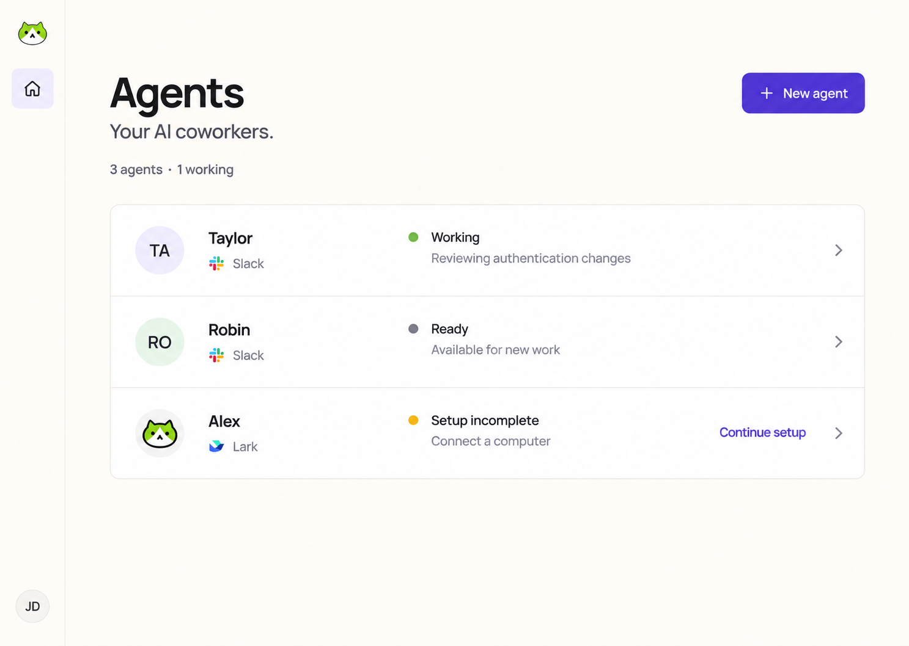

# OpenTag application design

Canonical style guide for OpenTag Web. Selected direction: **Concept 1 — Quiet Workspace**.
The app is a working tool: minimal, clean, and restrained. Every visible detail must help someone
choose an Agent, understand its state, follow its work, or configure it.

The visual foundation follows [opentag-site/design.md](https://github.com/first-tree-ai/opentag-site/blob/36596de/design.md):
warm cream, white surfaces, dark text, violet actions, Manrope, and the existing OpenTag mark.
The website's marketing composition does not carry into the app.

## Implementation and ownership

**Keep Kumo.** Its accessible primitives and existing behavior are retained behind the product adapter.
A shadcn migration would replace working controls without making their composition consistent by itself.
Consistency comes from these sources and the rules below:

| Source | Responsibility |
| --- | --- |
| [design.tokens.ts](apps/web/src/ui/design.tokens.ts) | Canonical palette and measurements |
| [theme.css](apps/web/src/ui/theme.css) | Generated palette, Kumo aliases, theme scope |
| [primitives.css](apps/web/src/ui/primitives.css) | Shared text, button, control, surface, and dialog recipes |
| [design-system.tsx](apps/web/src/ui/design-system.tsx) | Product intents, refs, labels, states, and Kumo compatibility |
| [app.css](apps/web/src/app.css) | Stylesheet entry, font loading, browser defaults, shell layout |
| [web-ui-contract.md](docs/design/web-ui-contract.md) | Composition, behavior, accessibility, and verification |
| [KUMO.md](apps/web/src/ui/KUMO.md) | Library-specific implementation details |

Edit tokens, then run `pnpm theme:generate`. Commit the generated stylesheet with the source.
`pnpm check` rejects drift. Import controls through the adapter; feature modules do not import Kumo
directly. Shared styling belongs at that seam, never in repeated page overrides.

Reconsider the component library only for a demonstrated requirement the adapter cannot satisfy.
Do not run two competing primitive systems through an incremental cosmetic migration.

## Color

| Role | Light value | Usage |
| --- | --- | --- |
| Canvas | `#fffcf7` | Application background |
| Surface | `#ffffff` | Lists, controls, distinct panels, dialogs |
| Primary text | `#171719` | Body, titles, meaningful icons |
| Secondary text | `#4c4d5c` | Descriptions and supporting labels |
| Muted text | `#6b6674` | Placeholders and less prominent metadata |
| Action | `#5638d8` | Primary action, link, checked control, focus |
| Action hover / pressed | `#452bb5` / `#38218f` | Flat interaction fills |
| Selection | `#f1ebff` | Current navigation or selected option |
| Structural line | `#e5e0db` | Dividers and surface boundaries |
| Control boundary | `#8c8795` | Meaningful control outlines |
| Recessed | `#f4f0e9` | Code, disabled, and inset surfaces |
| Neutral hover | `#f5f1eb` | Transient row and menu feedback |

Use semantic Kumo utilities and shared variables. Hairlines do not serve as the sole affordance for a
control. Brand violet does not mean successful, warning, or failed: retain the domain's status labels
and Kumo status semantics. A Ready Agent can also have supporting Working activity; do not merge those
two dimensions. Ready is success; Working task state is informational.

The lime cat is identity artwork, preserved as supplied. Do not recolor it or turn its lime into a
general UI accent. Provider artwork keeps its own identity. User avatars remain user data.

Light mode is the supported product theme. The scoped dark compatibility palette is not a new
dark-mode feature. Namespaced `data-opentag-theme` / `data-opentag-mode` attributes own the theme,
including portals.

## Typography and density

Self-host Manrope 400, 500, 600, and 700. Use the same family for body and headings, with the shared
Chinese/system fallback stack. Commands and logs retain monospace.
Fonts are emitted as same-origin files; Vite must not inline them as data URLs because the server
content policy disallows those font sources.

| Element | Size / weight |
| --- | --- |
| Page title | 28px desktop, 24px below 768px / 600 |
| Section title | 18px / 600 |
| Subsection title | 16px / 600 |
| Body and control text | 14px / 400–500 |
| Metadata | 12px / 400 |
| Brand lockup | 19px / 700 |

Use semantic `Text as="h1"` and a single page title. Use `PageHeader` for the title and actions.
Keep explanations near the decision they support; avoid repeating the title in an eyebrow.
Do not add slogans, welcome heroes, feature summaries, or decorative text to routine screens.

Use a 4px spacing grid. Default page/section gap: 24px; panel padding: 16–24px; row padding:
16px vertically, 16–20px horizontally; inline gaps: 8–12px. Authenticated content is bounded at
1024px with 32px desktop and 16px mobile gutters.

Default controls are 40px tall, compact desktop controls 32px, and mobile targets at least 44px.
Corners: controls 8px, grouped surfaces 12px, dialogs 16px. Keep content surfaces flat.
A small shadow is appropriate for a transient menu or dialog; do not lift routine panels on hover.
Buttons use solid fills, never glossy gradients.

## Navigation and screen composition

The workspace uses a full-height 72px rail with a small mark above Home and Account at the bottom.
Opening an Agent expands navigation to 240px, adding its switcher, sections, and Settings.
On mobile, use the compact header and Agent drawer. Preserve the mounted route and unsaved input
during viewport and scope changes.

| Screen family | Composition and essential information |
| --- | --- |
| All Agents | Compact title and New Agent action; count; one white roster divided into rows. Avatar, name, messaging provider, readiness/activity, and setup continuation when needed. Usage totals belong in Agent overview and Usage. |
| Agent overview | Identity and status first; concise dependency/readiness information, existing usage summary, recent tasks, and relevant capabilities. Distinct sections use the shared surface treatment. |
| Tasks | Compact header, search and status controls, aligned rows on wide layouts and stacked summaries on narrow layouts. Preserve source, title, state, activity, cancellation, pagination, and retry behavior. |
| Task detail | Title and state followed by the conversation/activity timeline. Keep speakers, replies, attachments, and logs readable; group dense metadata without introducing an app chat composer. |
| Usage | Compact title, window controls, totals, and existing charts/tables. Quiet borders and tabular numbers; no promotional statistics or duplicate summaries. |
| Context Tree | Connection identity and state, then the relevant connect/configure/operation controls. Commands use the neutral inset recipe. |
| MCP / Skills / integrations | Group related items with dividers, concise identity and state, then relevant actions. Forms and dialogs reuse controls and labels from the adapter. |
| Agent settings | Grouped settings, short labels, necessary hints, field-local errors. Keep execution, instructions, model, messaging, and destructive management distinct. |
| Account / Computers | Simple grouped configuration and connected-computer information. Account menus retain every current destination. |
| Login | Small centered form, identity, providers, language, and essential feedback. No splash artwork or large headings. Preserve provider-specific sign-in requirements. |
| Setup / onboarding | Task-focused steps and compact choices. Preserve readiness/repair, reserved-height stability, QR/copy controls, expiry, validation, and progress. No decorative gradients or hover lift. |
| Internal tools / previews | Same palette, type, and controls. Simulation controls remain clearly separated from the screen being previewed. |
| Empty / loading / error / not found | Short explanation and the relevant next action. Maintain skeletons, retries, field input, and focus behavior. |

Do not remove useful state or actions to make a screenshot look empty. Omit unavailable optional
metadata. Before adding a field or summary, identify the decision it helps with and check whether the
same information is already visible.

## Controls and states

Default to one clear primary action per task context. Supporting actions are secondary or ghost.
Destructive actions use danger semantics and existing confirmation/busy safeguards.

Keep visible labels, field association, disabled and busy states, meaningful hover, keyboard focus,
Escape and focus return, and localized copy. Native file/hidden inputs are the existing browser
exception. Avoid page-level control styling and hand-built substitutes for accessible primitives.

Use semantic selected state, not a general lilac background. Motion should explain a state change.
Reduced motion removes nonessential transitions.

## Change checklist

1. Reuse a page composition and shared control before adding one.
2. Put a reusable styling decision in tokens or recipes; update this guide for durable exceptions.
3. Preserve routing, ownership, localized copy, domain states, and keyboard behavior.
4. Check 320, 390, 768, and 1440px; contain wide logs/tables locally.
5. Run affected feature tests, adapter/theme contracts, and browser accessibility/interaction checks.
6. Run `pnpm check` before committing. Follow repository validation requirements for a pull request.

Text requires at least 4.5:1 contrast; meaningful controls and focus require 3:1.
The theme tests check text, action fills, and control boundaries. Static contracts enforce palette,
stylesheet, and import seams. Browser review remains necessary for layout and interaction.

## Selected reference

This image records the selected direction. Its oversized heading, glossy action, sample avatars,
and illustrative data are not production specifications. The compact, flat, real-data implementation
and this guide take precedence.
